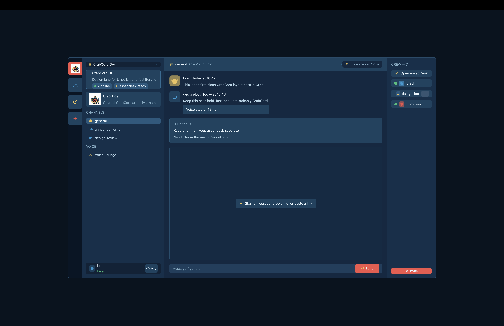
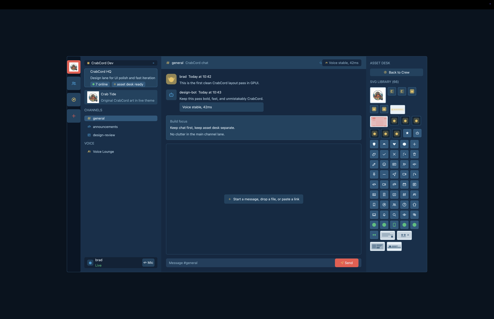

# CrabCord

CrabCord is a Rust + GPUI desktop UI shell with a custom CrabCord theme and asset system.

Current scope:
- single-window chat-style layout
- Crew mode and Asset Desk mode in the right panel
- interactive local UI state (`Mic`, `Send`, `Invite`, `Open Asset Desk`)
- SVG-first icon library with PNG fallback for complex brand art
- split UI modules for readability (`src/ui/shell/*.rs`)
- no backend, no routing, no persistence yet

## Screenshots

Crew view:



Asset Desk view:



## Requirements

- macOS (currently tested on macOS only)
- Rust stable (`rustup`)
- Xcode + Xcode Command Line Tools
- internet access on first build (downloads crates and GPUI git dependency)

Install missing macOS tooling:

```bash
xcode-select --install
```

Quick verification:

```bash
rustc --version
xcode-select -p
xcrun --find metal
```

## Quick Start

```bash
git clone https://github.com/<owner>/<repo>.git
cd gpui-playground
cargo run
```

Release run:

```bash
cargo run --release
```

## Current Interaction Model

- `Send`: cycles status line in the chat area
- `Mic`: toggles local mic state (`Live`/`Muted`)
- `Invite`: increments crew count in Crew mode
- `Open Asset Desk` / `Back to Crew`: toggles right panel mode

## Project Layout

```text
gpui-playground/
  assets/
    brand/
    mock/
    ui/
  docs/
    ARCHITECTURE.md
    ASSETS.md
    CHECKLIST.md
    RELEASE.md
    screenshots/
  src/
    assets.rs
    main.rs
    ui/
      elements.rs
      theme.rs
      shell.rs
      shell/
        render.rs
        left_panel.rs
        chat_panel.rs
        right_panel.rs
```

## Notes

- UI state lives in `src/ui/shell.rs`; panels/render are split under `src/ui/shell/`.
- Runtime assets are loaded relative to `assets/` via `FileAssetSource`.
- Packaging/release flow is documented in `docs/RELEASE.md`.

## Troubleshooting

If you hit `xcrun: error: unable to find utility "metal"`:

```bash
sudo xcode-select --switch /Applications/Xcode.app/Contents/Developer
```

If you hit `'dispatch/dispatch.h' file not found`:

```bash
xcode-select --install
sudo xcode-select --switch /Applications/Xcode.app/Contents/Developer
sudo xcodebuild -license accept
export BINDGEN_EXTRA_CLANG_ARGS="--sysroot=$(xcrun --show-sdk-path)"
```

Then retry:

```bash
cargo clean
cargo run
```

## References

- GPUI docs: https://docs.rs/gpui/latest/gpui/
- Zed macOS setup notes: https://zed.dev/docs/development/macos

## License

MIT. See `LICENSE`.
