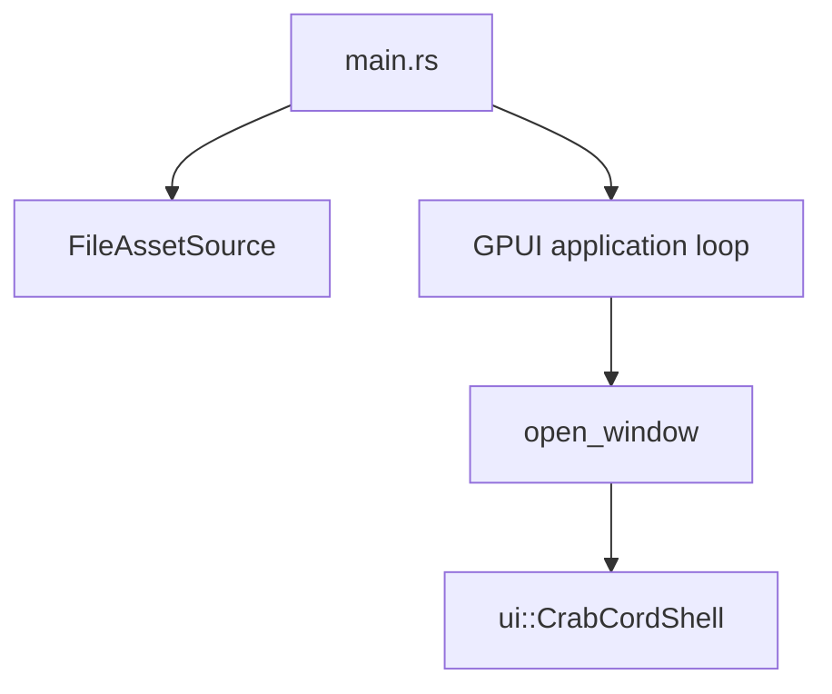

# CrabCord Architecture (Current)

## Tiny Diagram

## Why This Shape

- Current UI is a single screen, so architecture is intentionally flat.
- We avoid extra layers until there is real pressure (reuse, test seams, multi-screen flow).
- Asset loading stays separate because it is infrastructure-level and reused by any future screens.

## Runtime Flow

1. Process starts in `main`.
2. Asset source points to `<project>/assets`.
3. GPUI event loop starts.
4. Main window mounts `CrabCordShell`.
5. Button clicks mutate local state and call `cx.notify()` for re-render.

## Rule for Future Refactors

Only split `src/ui/shell.rs` when at least one of these is true:

- A UI block is reused in multiple places.
- State logic becomes hard to follow in one file.
- We add more screens/routes and need clear boundaries.
