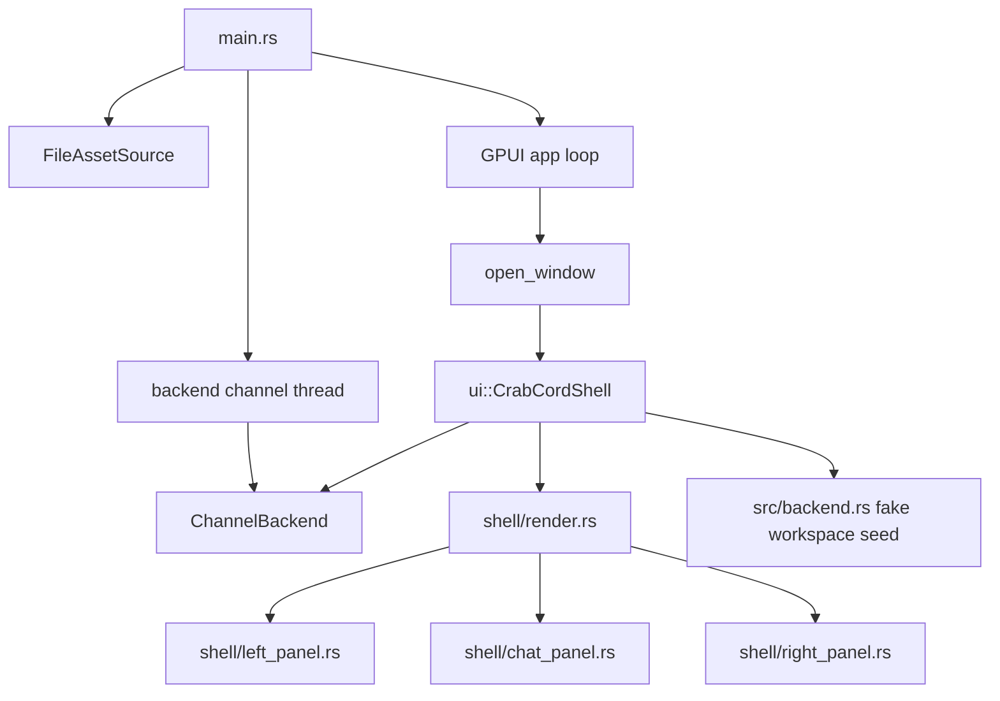

# CrabCord Architecture (Current)

## High-Level Diagram

## Current Shape

- One screen split into focused modules:
  - `src/ui/shell.rs`: shell state, selectors, action handlers
  - `src/ui/shell/render.rs`: top-level frame assembly
  - `src/ui/shell/left_panel.rs`: guilds, channels, DMs, local user controls
  - `src/ui/shell/chat_panel.rs`: header, timeline, input row
  - `src/ui/shell/right_panel.rs`: crew panel + asset desk mode
  - `src/ui/theme.rs`: palette + shared asset constants
  - `src/ui/elements.rs`: shared element builders
- Runtime assets load from `assets/` through `FileAssetSource`.
- Backend seam lives in `src/backend.rs`:
  - fake workspace seed data
  - command enum (`BackendCommand`)
  - backend sink trait (`BackendSink`)
  - channel-backed sink (`ChannelBackend`)
  - optional Axiom conversion helper (feature-gated)
- State in `CrabCordShell`:
  - `workspace`
  - `active_guild`
  - `active_conversation`
  - `messages`
  - `muted`
  - `online_count`
  - `show_asset_desk`
  - `compose_index`

## Runtime Flow

1. Startup begins in `main`.
2. Asset source mounts from `<repo>/assets`.
3. Backend channel worker thread starts.
4. GPUI event loop opens the main window.
5. `CrabCordShell` is created with fake workspace seed data + backend sink.
6. `CrabCordShell` renders the full layout:
   - guild rail
   - channels + DMs list
   - timeline center lane
   - right panel (Crew or Asset Desk)
7. User interactions mutate local state, emit backend commands, and call `cx.notify()`.

## UI Mode Behavior

- Default right panel: `Crew Mode`
  - grouped member list
  - invite action
- Alternate right panel: `Asset Desk`
  - full PNG asset gallery
  - scrollable asset inspection area

Mode switch is controlled by `show_asset_desk`.

## Backend Command Path

- Guild select: `GuildSelected`
- Channel select: `ChannelSelected`
- DM select: `DmSelected`
- Send message: `MessageSent`
- Mic toggle: `MicToggled`
- Invite click: `MemberInvited`
- Asset desk toggle: `AssetDeskToggled`

With `--features axiom-backend`, commands can be converted to `axiom::prelude::Message`.
