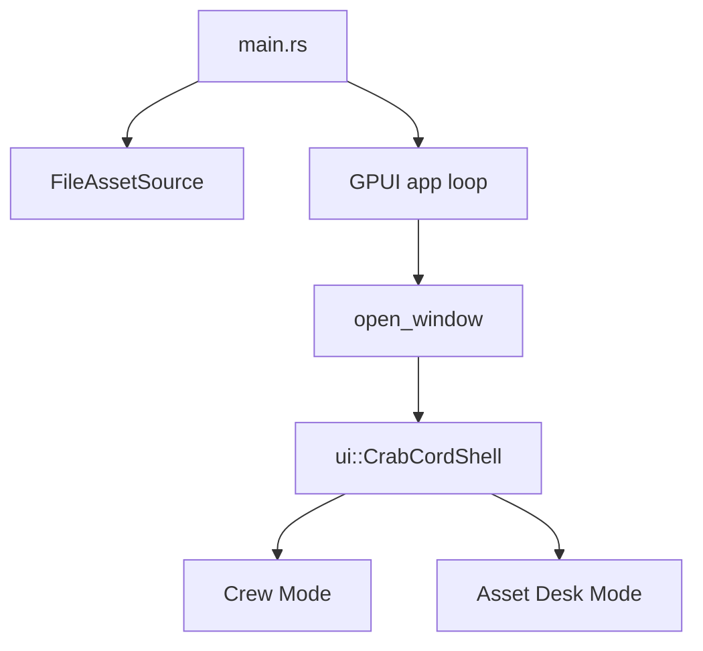

# CrabCord Architecture (Current)

## High-Level Diagram

## Current Shape

- One screen, one primary UI module: `src/ui/shell.rs`.
- Runtime assets loaded from `assets/` through `FileAssetSource`.
- State is intentionally local to `CrabCordShell`:
  - `status_index`
  - `muted`
  - `online_count`
  - `show_asset_desk`

## Runtime Flow

1. Startup begins in `main`.
2. Asset source mounts from `<repo>/assets`.
3. GPUI event loop opens the main window.
4. `CrabCordShell` renders the full layout:
   - guild rail
   - channel sidebar
   - chat center lane
   - right panel (Crew or Asset Desk)
5. Interactions mutate local state and call `cx.notify()`.

## UI Mode Behavior

- Default right panel: **Crew Mode**
  - member rows
  - invite action
- Alternate right panel: **Asset Desk**
  - full SVG gallery
  - scrollable asset inspection area

Mode switch is controlled by `show_asset_desk`.

## Refactor Rule

Split `src/ui/shell.rs` only when there is real pressure:

- repeated UI blocks need reuse
- state transitions become difficult to reason about
- additional screens/routes are introduced
